# eKYC System Design - Quick Reference

> **Project**: Fullstack eKYC Onboarding Platform  
> **Stack**: React Native (Expo) + Node.js/Express + TypeScript  
> **Architecture**: Monorepo

## Overview

eKYC verification system with 5-step mobile onboarding, JWT authentication, and real-time status tracking

## System Architecture

### High-Level Architecture

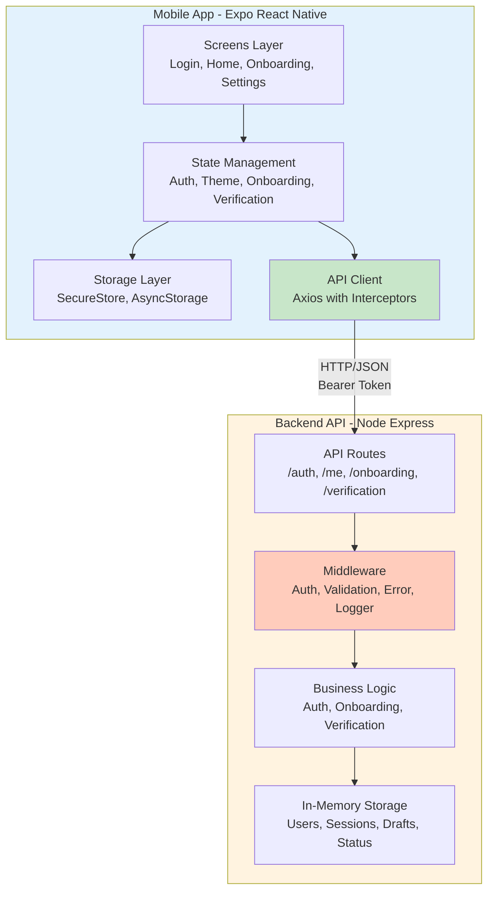

### Backend Layered Architecture

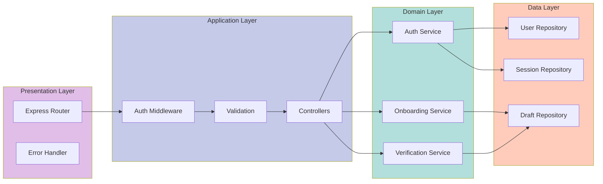

### Data Flow Architecture

```mermaid
flowchart LR
    User((User))
    
    subgraph Mobile[Mobile App]
        LoginForm[Login Form]
        OnboardingForm[Onboarding Forms]
        HomeDisplay[Home Display]
        
        subgraph MobileStores[Stores]
            AuthData[Auth Data]
            DraftData[Draft Data]
        end
        
        subgraph MobileStorage[Storage]
            SecureStore[SecureStore<br/>Tokens]
            AsyncStore[AsyncStorage<br/>Draft + Theme]
        end
    end
    
    subgraph Backend[Backend API]
        AuthEndpoint[/auth/login]
        SubmitEndpoint[/onboarding/submit]
        StatusEndpoint[/verification/status]
        MeEndpoint[/me]
        
        subgraph BackendStorage[In-Memory Storage]
            Users[(Users)]
            Sessions[(Sessions)]
            Drafts[(Drafts)]
            Statuses[(Verification<br/>Statuses)]
        end
    end
    
    User -->|Enter credentials| LoginForm
    LoginForm -->|Login| AuthEndpoint
    AuthEndpoint -->|Create| Sessions
    AuthEndpoint -->|Lookup| Users
    AuthEndpoint -->|Return tokens| AuthData
    AuthData -->|Store| SecureStore
    
    User -->|Fill forms| OnboardingForm
    OnboardingForm -->|Update| DraftData
    DraftData -->|Persist| AsyncStore
    DraftData -->|Submit| SubmitEndpoint
    SubmitEndpoint -->|Save| Drafts
    SubmitEndpoint -->|Update| Statuses
    
    HomeDisplay -->|Fetch| MeEndpoint
    HomeDisplay -->|Fetch| StatusEndpoint
    MeEndpoint -->|Get| Users
    StatusEndpoint -->|Get| Statuses
    
    style User fill:#90caf9
    style Mobile fill:#e3f2fd
    style Backend fill:#fff3e0
    style SecureStore fill:#ffccbc
    style AsyncStore fill:#d1c4e9
```

## API Endpoints

| Endpoint | Method | Auth | Purpose |
|----------|--------|------|---------|
| `/v1/auth/login` | POST | No | Login (returns JWT) |
| `/v1/auth/refresh` | POST | No | Refresh token |
| `/v1/me` | GET | Yes | User info |
| `/v1/onboarding/submit` | POST | Yes | Submit onboarding |
| `/v1/verification/status` | GET | Yes | Verification status |

## Mobile Flow

**Screens**: Login → Home → Onboarding (5 steps) → Settings

**Onboarding Steps**:
1. Profile (Name, DOB, Nationality)
2. Document (Type, Number)
3. Address (Line, City, Country)
4. Consents (Terms)
5. Review & Submit

## Data Models
```typescript
interface User {
  id: string;
  email: string;
  fullName: string;
}

interface Session {
  accessToken: string;        // Short-lived (15 min)
  refreshToken: string;       // Long-lived (7 days)
  expiresAt: string;
}
```

### Onboarding Draft
```typescript
interface OnboardingDraft {
  profile: {
    fullName: string;
    dateOfBirth: string;
    nationality: string;
  };
  document: {
    documentType: 'PASSPORT' | 'DRIVERS_LICENSE' | 'NATIONAL_ID';
    documentNumber: string;
  };
  address: {
    addressLine1: string;
    city: string;
    country: string;
  };
  consents: {
    termsAccepted: boolean;
  };
}
```

### Verification Status
```typescript
interface VerificationStatus {
  status: 'NOT_STARTED' | 'IN_PROGRESS' | 'APPROVED' | 'REJECTED' | 'MANUAL_REVIEW';
  updatedAt: string;
  details: {
    reasons: string[];
  };
}
```

## State Management (Zustand)

### State Architecture

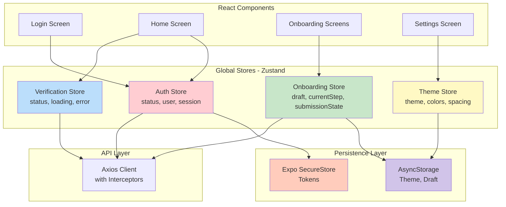

### Store Details

**Stores**:
- **Auth**: User, session, tokens (SecureStore)
  - Status: `logged_out | logging_in | logged_in | refreshing | expired`
  - Actions: `login()`, `logout()`, `refreshSession()`
  
- **Theme**: Light/dark mode (AsyncStorage)
  - Theme: `light | dark`
  - Actions: `toggleTheme()`, `setTheme()`
  
- **Onboarding**: Draft data, current step (AsyncStorage)
  - Draft: Profile, document, address, consents
  - Current Step: 0-4 (5 steps total)
  - Actions: `updateProfile()`, `updateDocument()`, `updateAddress()`, `updateConsents()`, `submitOnboarding()`
  
- **Verification**: Status from backend (no persistence)
  - Status: Cached from API
  - Actions: `fetchStatus()`, `clearStatus()`

### State Synchronization Pattern

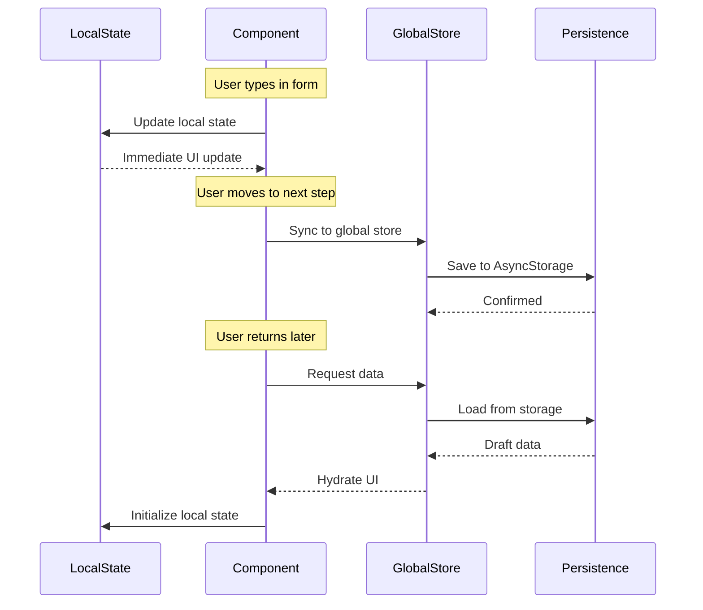

## Key Flows

### 1. Authentication Flow

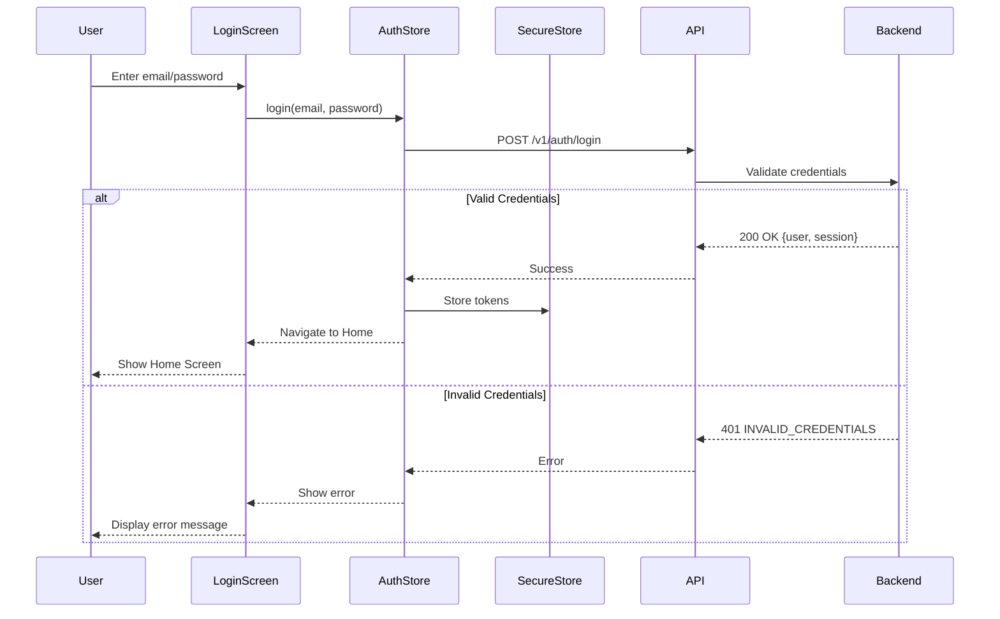

### 2. Token Refresh Flow (Automatic)

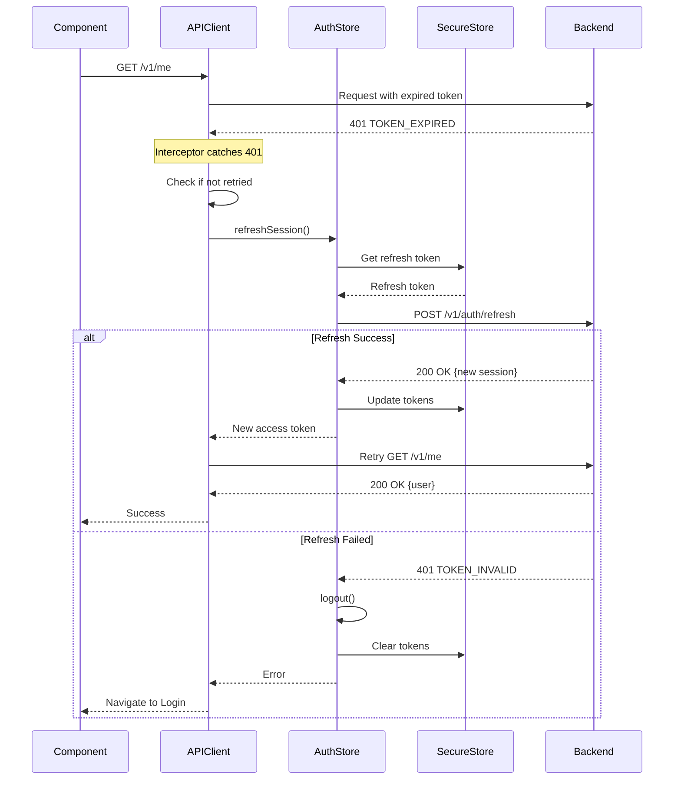

### 3. Onboarding Submission Flow

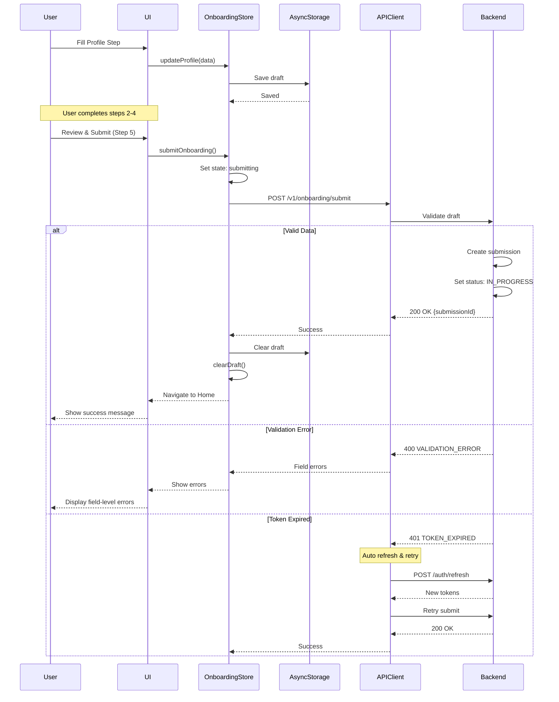

### 4. Home Screen Data Loading

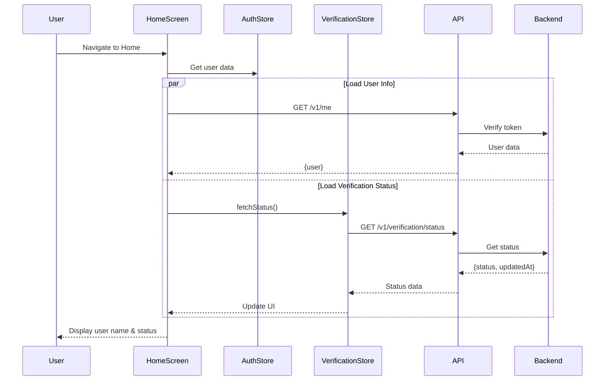

### 5. Mobile Navigation Flow

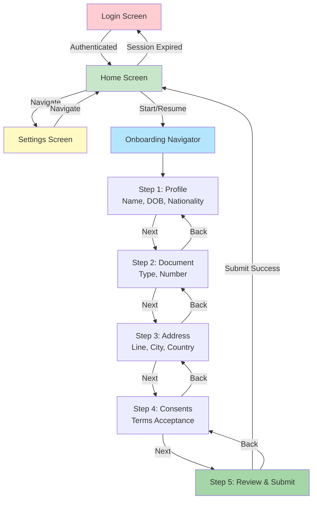

## Error Handling

### Error Response Format

```json
{
  "error": {
    "code": "VALIDATION_ERROR",
    "message": "Invalid input",
    "details": {
      "fieldErrors": {
        "profile.fullName": "Required",
        "document.documentNumber": "Invalid format"
      }
    }
  }
}
```

### Error Codes

- `VALIDATION_ERROR` (400) - Invalid input with field errors
- `INVALID_CREDENTIALS` (401) - Wrong login
- `TOKEN_EXPIRED` (401) - Refresh needed
- `TOKEN_INVALID` (401) - Re-login required
- `INTERNAL_ERROR` (500) - Server error

### Error Flow Diagram

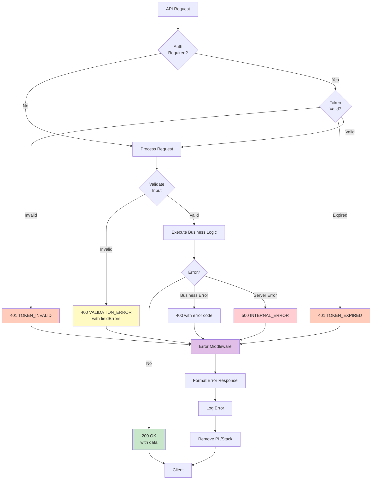

## Security

### Token Lifecycle & Security Flow

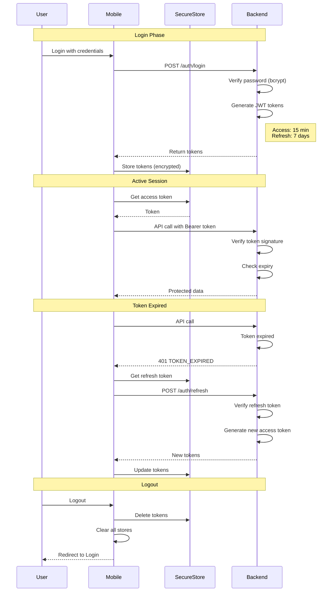

### Security Architecture

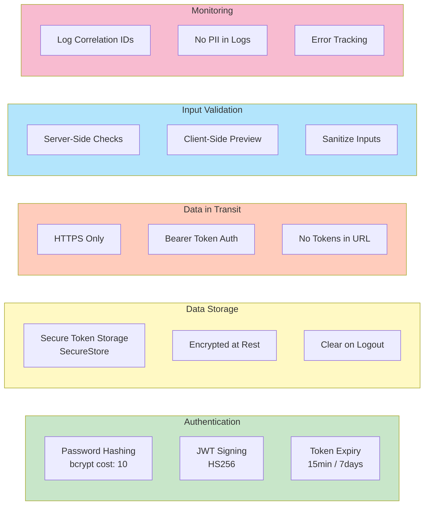

### Security Best Practices

**Tokens**:
- Access: 15 min (SecureStore)
- Refresh: 7 days (SecureStore)
- Never logged in console or errors
- Cleared on logout

**Backend**: 
- ✅ Bcrypt passwords (cost factor: 10)
- ✅ Server-side validation (never trust client)
- ✅ No stack traces to client
- ✅ Helmet.js for HTTP security headers
- ✅ Correlation IDs for tracing
- ✅ Sanitize PII from logs

**Mobile**: 
- ✅ SecureStore for tokens (encrypted)
- ✅ AsyncStorage for non-sensitive data
- ✅ Route guards for protected screens
- ✅ Clear sensitive data on logout
- ✅ Validate inputs before API calls

## Tech Stack

**Backend**: Node.js, Express, JWT, bcrypt, express-validator, winston, jest  
**Mobile**: Expo (React Native), React Navigation, Zustand, React Hook Form + Zod, Axios, SecureStore

## Project Structure

### Component Architecture

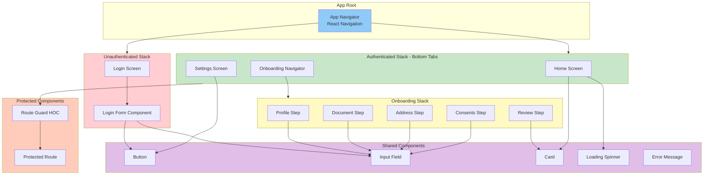

### Directory Structure

```
ekyc-onboarding/
├── apps/
│   ├── api/               # Backend (Express)
│   │   ├── src/
│   │   │   ├── server.ts
│   │   │   ├── app.ts
│   │   │   ├── middleware/
│   │   │   │   ├── auth.middleware.ts
│   │   │   │   ├── validation.middleware.ts
│   │   │   │   └── error.middleware.ts
│   │   │   ├── routes/
│   │   │   │   ├── auth.routes.ts
│   │   │   │   ├── user.routes.ts
│   │   │   │   ├── onboarding.routes.ts
│   │   │   │   └── verification.routes.ts
│   │   │   ├── services/
│   │   │   │   ├── auth.service.ts
│   │   │   │   └── onboarding.service.ts
│   │   │   └── repositories/
│   │   │       ├── user.repository.ts
│   │   │       ├── session.repository.ts
│   │   │       └── onboarding.repository.ts
│   │   └── tests/
│   │
│   └── mobile/            # Mobile (Expo)
│       ├── src/
│       │   ├── App.tsx
│       │   ├── screens/
│       │   │   ├── LoginScreen.tsx
│       │   │   ├── HomeScreen.tsx
│       │   │   ├── OnboardingScreen.tsx
│       │   │   └── SettingsScreen.tsx
│       │   ├── components/
│       │   │   ├── common/
│       │   │   └── onboarding/
│       │   ├── stores/
│       │   │   ├── authStore.ts
│       │   │   ├── themeStore.ts
│       │   │   ├── onboardingStore.ts
│       │   │   └── verificationStore.ts
│       │   ├── services/
│       │   │   └── api/
│       │   │       └── client.ts
│       │   └── theme/
│       └── tests/
│
├── package.json
└── README.md
```

## Implementation Plan

### Implementation Timeline

```mermaid
gantt
    title eKYC Implementation Timeline (90 minutes)
    dateFormat mm
    axisFormat %M min
    
    section Setup
    Init Monorepo           :milestone, m1, 00, 0m
    Install Dependencies    :a1, 00, 10m
    TypeScript Config       :a2, after a1, 5m
    
    section Backend
    Express Server          :b1, after a2, 10m
    Auth Routes             :b2, after b1, 15m
    Validation Middleware   :b3, after b2, 10m
    
    section Mobile
    Navigation Setup        :c1, after a2, 10m
    Auth Store & Login      :c2, after c1, 15m
    Onboarding Screens      :c3, after c2, 20m
    Theme Implementation    :c4, after c3, 10m
    
    section Integration
    Connect API             :milestone, m2, after c4, 0m
    End-to-End Test         :d1, after m2, 10m
    
    section Production
    Error Handling          :milestone, m3, after d1, 0m
    Refresh-Retry Logic     :e1, after m3, 10m
    Logging & Tests         :e2, after e1, 15m
    
    section Optional
    Advanced Feature        :f1, after e2, 15m
```

### Milestone Breakdown

**Phase 1 - Core Flow** (55-65 min):

1. **Setup** (10 min)
   - Init monorepo
   - Install dependencies
   - Setup TypeScript configs

2. **Backend** (20 min)
   - Express server with routes
   - In-memory storage
   - Auth middleware
   - Basic validation

3. **Mobile** (25 min)
   - Navigation setup
   - Auth store + Login screen
   - Onboarding screens (5 steps)
   - Home screen with status
   - Settings with theme toggle

4. **Integration** (10 min)
   - Connect mobile to API
   - Test end-to-end flow

**Phase 2 - Production Ready** (20-30 min):

1. **Backend** (10 min)
   - Centralized validation
   - Consistent error format
   - Structured logging
   - Request correlation IDs

2. **Mobile** (10 min)
   - Token refresh-then-retry
   - Route guards
   - Session expiry handling
   - Field-level error display

3. **Testing** (10 min)
   - Backend: Auth flow test
   - Backend: Validation error test
   - Mobile: Refresh-retry test
   - Mobile: Draft persistence test

**Phase 3 - Advanced** (Optional):

Pick ONE if time permits:
- **Option A**: Idempotency for submit
- **Option B**: Async verification + polling
- **Option C**: Offline queue
- **Option D**: OpenAPI spec + typed client

## Testing

### Test Architecture

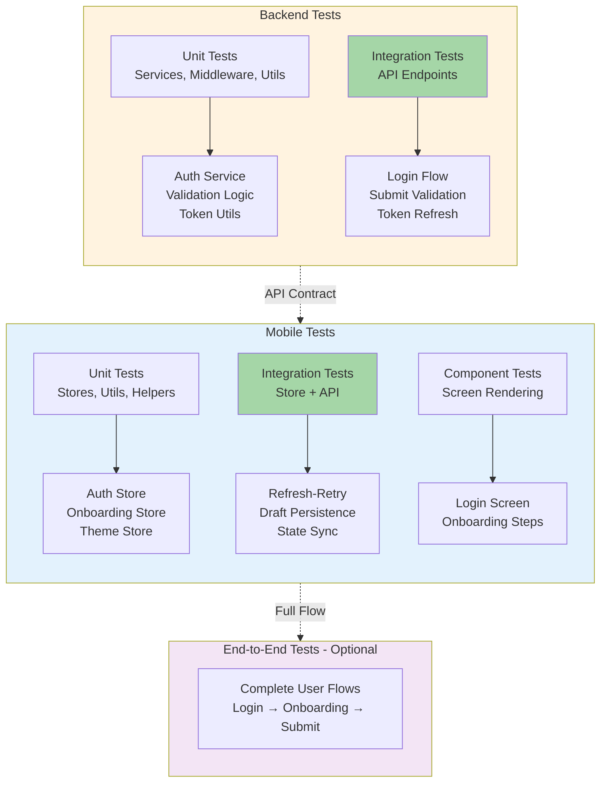

### Backend Tests (Jest + Supertest)

```typescript
// Auth flow test
test('login and access protected route', async () => {
  const login = await POST('/v1/auth/login');
  expect(login.status).toBe(200);
  
  const me = await GET('/v1/me', { token: login.body.session.accessToken });
  expect(me.status).toBe(200);
});

// Validation test
test('submit returns field errors', async () => {
  const res = await POST('/v1/onboarding/submit', { draft: { profile: {} } });
  expect(res.status).toBe(400);
  expect(res.body.error.code).toBe('VALIDATION_ERROR');
  expect(res.body.error.details.fieldErrors).toBeDefined();
});
```

### Mobile Tests (Jest + React Native Testing Library)

```typescript
// Refresh-then-retry test
test('should refresh token and retry on 401', async () => {
  mockAPI.onGet('/v1/me').replyOnce(401);
  mockAPI.onPost('/v1/auth/refresh').replyOnce(200, { session: newTokens });
  mockAPI.onGet('/v1/me').replyOnce(200, { user });
  
  const result = await apiClient.get('/v1/me');
  expect(result.data.user).toEqual(user);
});

// Draft persistence test
test('should persist and restore draft', async () => {
  store.updateProfile({ fullName: 'John' });
  await wait(100);
  
  store.clearDraft();
  await store.loadPersistedDraft();
  
  expect(store.draft.profile.fullName).toBe('John');
});
```

## Design Decisions

| Component | Choice | Why |
|-----------|--------|-----|
| State | Zustand | Simple, TypeScript-first |
| Forms | React Hook Form + Zod | Type-safe validation |
| HTTP | Axios | Interceptor for auto-refresh |
| Storage | In-Memory Maps | Fast, no DB setup |
| Tokens | JWT (15min + 7d refresh) | Stateless, standard |

## Quick Start

```bash
# Backend
cd apps/api && npm install && npm run dev  # :3000

# Mobile (separate terminal)
cd apps/mobile && npm install && npx expo start
```

---

**Version**: 1.0 | **Updated**: Feb 2026
